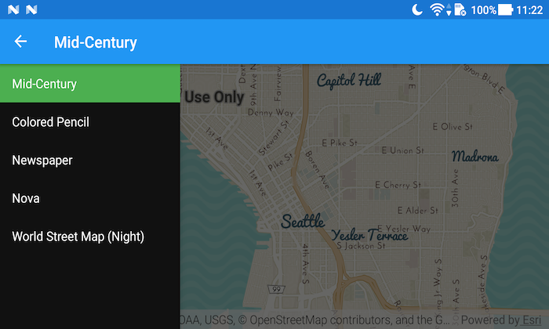

# ArcGIS Vector Tiled Layer URL



This app creates `Basemap`s from an `ArcGISVectorTiledLayer` which is pointed to an ArcGIS Vector Tile Service.
It shows how to inflate a `MapView` in the layout XML of the activity, creates a `ArcGISVectorTiledLayer` from an ArcGIS Online service URL and bind that to a `Basemap`.  The `Basemap` is used to create a `Map` which is used inside of the `MapView`. It uses Android Navigation drawer to switch between different Vector Tiled Layers. By default, this map supports basic zooming and panning operations.

## Features
* MapView
* ArcGISMap
* Basemap
* ArcGISVectorTiledLayer

## Developer Pattern
```kotlin
// create a map with the basemap and set it to the map view
mapView.map = ArcGISMap().apply {
  // set vector tiled layer from url as basemap
  basemap = Basemap(ArcGISVectorTiledLayer(getString(R.string.mid_century_url)))
  // create a viewpoint from lat, long, scale
  initialViewpoint = Viewpoint(47.606726, -122.335564, 72223.819286)
}
```
